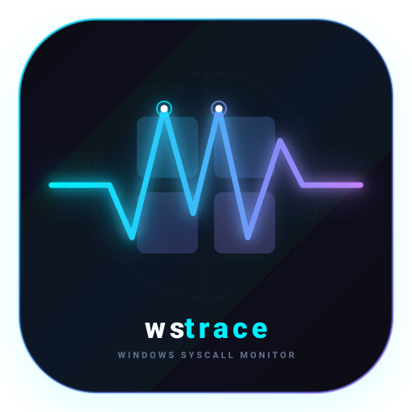

<p align="center">
  
</p>

<h1 align="center">wstrace</h1>

<p align="center">
  <strong>High-performance zero-driver Windows system and API monitor in Rust.</strong>
</p>

<p align="center">
  <a href="LICENSE"></a>
  <a href="https://github.com/sponsors/gilnett"></a>
  <a href="https://ko-fi.com/gilnet"></a>
</p>

<p align="center">
  Modern <code>strace</code> and real-time Process Monitor for Windows. Built in native Rust with zero kernel drivers required, featuring a real-time terminal user interface (TUI) and unbuffered streaming for headless diagnostics.
</p>

---

## Installation

### PowerShell Script

```powershell
powershell -ExecutionPolicy Bypass -File .\packaging\install.ps1
```

Installs `wstrace.exe` to `$HOME\.local\bin` and registers the directory into the User `PATH` environment variable.

### Windows Package Manager (Winget)

```cmd
winget install gilnett.wstrace
```

### Scoop

```cmd
scoop install packaging/scoop/wstrace.json
```

### Cargo (From Source)

```bash
cargo install --path .
```

### Prebuilt Binary

Compile directly using the Rust toolchain:

```bash
cargo build --release
```

The resulting standalone executable is located at `target\release\wstrace.exe`.

---

## Usage Guide

### Verification

Confirm that `wstrace` is accessible in the current shell:

```bash
wstrace --version
```

---

### Interactive TUI Mode

Launches the target application with a real-time event table:

```bash
wstrace run <executable_path> [-- <arguments>...]
```

#### TUI Keyboard Controls

| Key | Action | Description |
| :--- | :--- | :--- |
| `Ctrl+C` | **Copy Selected** | Copies the highlighted event details into the Windows clipboard. |
| `Ctrl+A` | **Copy All** | Copies all currently filtered events into the Windows clipboard. |
| `Ctrl+E` / `Space` | **Pause / Resume** | Freezes the event view without dropping incoming telemetry. |
| `Ctrl+X` | **Clear Buffer** | Empties the current event list from the display buffer. |
| `Tab` | **Category Cycle** | Filters events: `ALL` -> `FILE` -> `REG` -> `NET` -> `PROC`. |
| `f` | **Failures Only** | Restricts view to failed operations (e.g. access denied, not found). |
| `Up` / `Down` | **Navigation** | Selects an event for deep inspection. |
| `q` / `Esc` | **Exit** | Terminates the tracing session cleanly. |

---

### Attach to Running Process

Attach to an existing process by Process Identifier (PID) or binary name without restarting it:

```bash
# Attach by PID
wstrace attach -p <PID>

# Attach by process executable name
wstrace attach -n <process_name.exe>
```

---

### Child Process Tracking (`-C` / `--children`)

Tracks the target process and recursively monitors all child processes spawned by it:

```bash
wstrace -C run <executable_path> [-- <arguments>...]
```

---

### Path Filtering (`--include` and `--exclude`)

Isolate relevant operations or suppress operating system noise:

```bash
# Include only operations matching a substring
wstrace --include "<substring>" run <executable_path>

# Exclude operations matching a substring
wstrace --exclude "<substring>" run <executable_path>
```

---

### Headless Stream Mode (`-m stream`)

Writes live events directly to stdout with ANSI color codes for logging or CI/CD pipelines:

```bash
wstrace -m stream [-d <seconds>] run <executable_path>
```

---

### Structured JSON Export (`--export-json`)

Exports all captured session events to a formatted JSON file upon termination:

```bash
wstrace --export-json <output_file.json> run <executable_path>
```

---

### Clipboard Export (`--copy` / `--to-clipboard`)

Automatically copies all captured session events directly to the Windows clipboard upon exit:

```bash
wstrace --copy run <executable_path>
```

---

## Architecture & Compatibility

- **Language:** Rust (2021 Edition)
- **Terminal UI:** Ratatui + Crossterm
- **Telemetry Ingestion:** Win32 APIs (`ToolHelp32Snapshot`, `OpenProcess`, `VirtualQueryEx`) & Event Tracing for Windows (`ETW`).
- **Target Architectures:**
  - `x86_64-pc-windows-msvc` (Intel / AMD 64-bit)
  - `aarch64-pc-windows-msvc` (Qualcomm Snapdragon X / Windows on ARM)

---

## Security & OWASP Governance

`wstrace` is built to comply with institutional security standards:
- **Memory Safety:** Developed 100% in Rust, preventing buffer overflows, use-after-free, and race conditions at compile time.
- **Zero-Driver Architecture:** Operates entirely in user-mode without kernel drivers, eliminating ring-0 attack surfaces, rootkit vectors, and BSOD stability risks.
- **OWASP Rule #1 Compliance:** Zero hardcoded credentials, API keys, or private tokens in source code or version control history.

---

## Privacy & GDPR (RGPD) Compliance

- **Privacy by Design:** `wstrace` is completely air-gapped and offline. It does not contain telemetry, tracking SDKs, or outbound network calls.
- **Local Data Isolation:** All captured telemetry, JSON export files, and clipboard buffers reside strictly on the user's local workstation under their exclusive custody.

---

## License & Intellectual Property Governance

- **Software License:** Licensed under the [GNU General Public License v3.0](LICENSE) (GPL-3.0-or-later).
- **Contributor License Agreement (CLA):** All external contributions are subject to the terms outlined in [CONTRIBUTING.md](CONTRIBUTING.md), ensuring unified copyright ownership and protecting corporate acquisition (M&A) and commercial dual-licensing rights.

---

## Acknowledgements & Third-Party Credits

`wstrace` is proud to build upon the Rust open-source ecosystem and acknowledges the following foundational libraries:
- [Ratatui](https://github.com/ratatui/ratatui) (MIT) — Modern terminal user interface (TUI) layout and rendering engine.
- [Crossterm](https://github.com/crossterm-rs/crossterm) (MIT) — Cross-platform terminal manipulation and raw input control.
- [windows-sys](https://github.com/microsoft/windows-rs) (MIT / Apache-2.0) — Official Microsoft Win32 and Kernel ETW API bindings.

For complete license notices and terms, see [THIRD_PARTY_LICENSES.md](THIRD_PARTY_LICENSES.md).

---

## Support & Sponsorship

If you find `wstrace` useful for your Windows engineering, security audits, or performance debugging, you can support development via GitHub Sponsors or Ko-fi:

[](https://github.com/sponsors/gilnett)
[](https://ko-fi.com/gilnet)

- **GitHub Sponsors:** [https://github.com/sponsors/gilnett](https://github.com/sponsors/gilnett)
- **Ko-fi:** [https://ko-fi.com/gilnet](https://ko-fi.com/gilnet)


